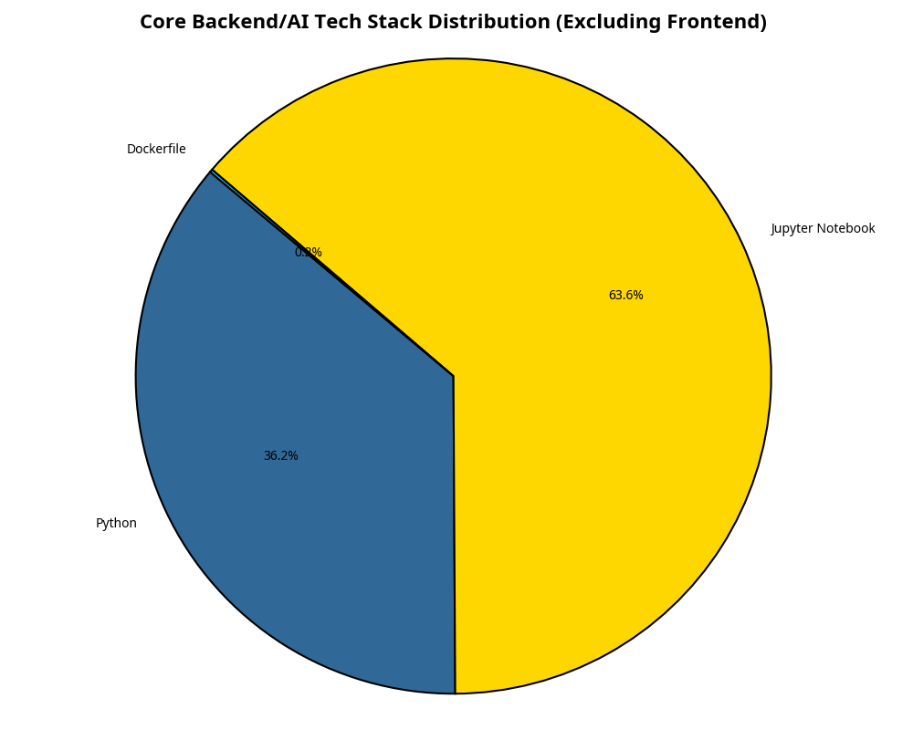
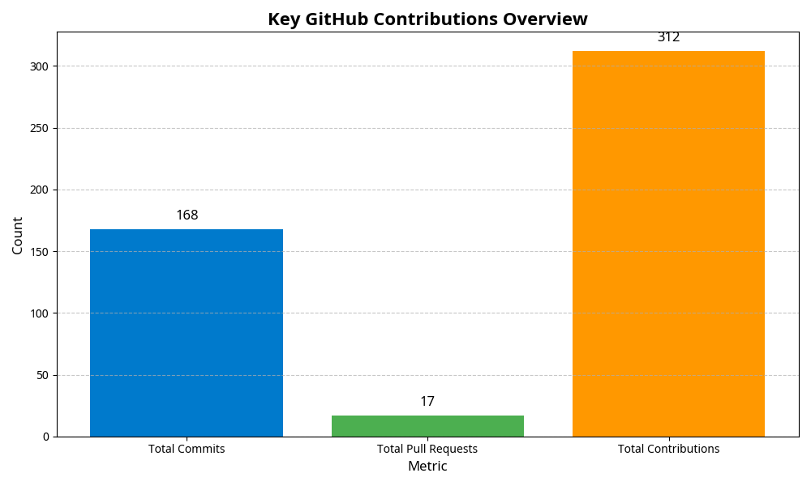

# 👨‍💻 Muhammad Siddiq - Aspiring Generative AI Engineer

## 🚀 Overview
Welcome to my GitHub profile! I am an aspiring Generative AI Engineer, passionate about AI, Machine Learning, and Deep Learning. My work focuses on building robust, AI-driven solutions, primarily utilizing **Python** and **Jupyter Notebooks** for data science, backend logic, and model development.

This README serves as a dynamic, data-driven visualization of my core technical contributions, specifically highlighting my backend, AI, and data-focused work, as requested.

## 💡 Personal Philosophy
> "The future belongs to those who can master the art of conversation with machines." - *Muhammad Siddiq*

## 📊 Core Technical Stack Visualization
This visualization focuses on the languages and technologies I use for core logic, data processing, and AI model development, intentionally excluding frontend code (HTML, CSS, JavaScript, TypeScript) which is often scaffolded or generated by agents.

### Language Distribution (Backend/AI Focus)

| Language/Tool | Primary Use Case |
| :--- | :--- |
| **Jupyter Notebook** | Exploratory Data Analysis (EDA), Model Prototyping, Internship Tasks |
| **Python** | Backend Logic, AI/ML Model Implementation, Scripting, MCP Development |
| **Dockerfile** | Containerization and Deployment of AI Services |
| **LangChain** | Orchestration and Development of LLM Applications |
| **LangGraph** | Building Resilient, State-Aware LLM Agents and Workflows |
| **LangSmith** | Debugging, Testing, and Monitoring LLM Applications |

## 📈 Contribution Statistics
A snapshot of my overall activity on GitHub, reflecting my commitment to continuous development and collaboration.

### Key Contributions

| Metric | Count |
| :--- | :--- |
| **Total Contributions** | 312 |
| **Total Commits** | 168 |
| **Total Pull Requests** | 17 |

## 📦 Top Projects by Activity
These repositories represent my most active projects, measured by the number of commits. They showcase my dedication to building and maintaining complex systems.

### Most Active Repositories

| Repository | Commits | Primary Focus |
| :--- | :--- | :--- |
| **LMS** | 66 | Learning Management System (Backend/AI features) |
| **Expense-tracker-MCP** | 19 | Model Context Protocol (MCP) Development, Python Backend |
| **Bank-Churn-Prediction** | 15 | Machine Learning, Data Analysis, Predictive Modeling |
| **twitter-mcp** | 10 | Model Context Protocol (MCP) Development, Backend Logic |
| **Iris-** | 10 | Data Science, Classification Model |
| **Personalized-Exam-Preparation-AI** | 10 | AI-driven Educational Tool, Python Backend |
| **Internship_tasks** | 9 | Data Science Tasks, Jupyter Notebooks |
| **AI-Legal-Assistant** | 5 | AI-powered Legal Query System, Python Backend |

---
*This README was generated automatically by an AI Agent based on an analysis of the GenAIwithMS GitHub profile.*
